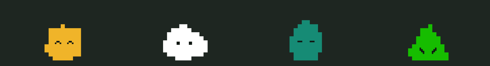
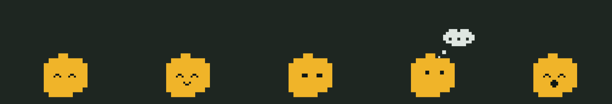

# Bot Companions

Little pixel-block versions of your [bb](https://getbb.app) bots that live in their own chats. Each companion sits by the message box, watches while you type, thinks while the chat is working and talks while it replies. Pick one up and it hangs from your cursor like a water balloon, then flies, lands, squashes and reforms when you let go.



## What you get

- **A soft-body character per bot.** Bodies are solid, flat blocks drawn from a small particle simulation, so they stretch, drip and wobble but never show shading. The shape (round, cloud, triangle, blob, squircle, capsule) and colour come from each bot's own avatar settings, and each shape gets its own face.
- **Moods.** Idle (breathing, blinking, glancing around), watching (follows the caret while you type), thinking (eyes up, thought bubble) and talking (mouth flaps while a reply streams in).


- **Play.** Tap to greet. Drag to pick it up and throw it. Double-click, or focus it and press Escape, to send it home. Where you leave it is remembered per chat.
- **A header toggle** to hide or show the companion in each chat, and a **Bot characters** switch in the sidebar footer that turns every companion off (and freezes the animated sidebar avatars) on that device.

## Requirements

- bb 0.45 or newer.
- The [Bots Sidebar](https://github.com/tobi/bb-bots-sidebar) plugin. Companions take their identity from its `bots_list` RPC: a chat gets the bot it is bound to, otherwise the bot whose main thread it is, otherwise the owner of its project. Chats with no bot show no companion.

## Install

```sh
bb plugin install git:https://github.com/Slicler/bb-plugin-bot-companions.git
```

Or clone it and run `bb plugin install .` from the folder. Installing from Git builds the plugin for you.

## Power use

The animation is built to be cheap:

- Each frame's blocks are recorded first and the canvas is only repainted when they change, so a resting companion repaints a few times a second.
- The canvas covers only the companion, not the window, and moves with a compositor-only transform.
- Drawing is capped at 60 fps while lively (held, airborne, dripping, talking) and 30 fps while quiet. Physics keeps its own fixed 180 Hz step.
- The chat transcript is only read while the chat is working.
- Reduced motion, and bb's Calm mode (`html[data-calm]`), stop the ambient motion.

To save power on a machine nobody sits at, set `OFF_ON_HOST = true` at the top of the **Power** block in `app.tsx`. Companions then start off at `localhost` and on everywhere else (a saved choice always wins).

If another plugin sets `html[data-bb-resting]`, every companion switches off on every device until the attribute is removed.

## Development

```sh
npm install
./node_modules/.bin/tsc --noEmit --skipLibCheck
bb plugin build
bb plugin reload bot-companions
```

- `softbody.ts`: particle simulation (springs, pressure, tearing, drops, grab and throw).
- `sprites.ts`: block rendering, faces and moods.
- `app.tsx`: the chat header slot, animation loop, and sidebar switch.
- `server.ts`: reads bots from the Bots Sidebar plugin, cached for five seconds.

This is a stylized viscoelastic animation, not a scientific fluid solver.

## License

MIT
